RedWine
================

### 1. Stream-of-consciousness analysis and exploration of the data.

Quick exploration of the Redwine dataset shows:

    ##  [1] "X"                    "fixed.acidity"        "volatile.acidity"    
    ##  [4] "citric.acid"          "residual.sugar"       "chlorides"           
    ##  [7] "free.sulfur.dioxide"  "total.sulfur.dioxide" "density"             
    ## [10] "pH"                   "sulphates"            "alcohol"             
    ## [13] "quality"

    ## 'data.frame':    1599 obs. of  13 variables:
    ##  $ X                   : int  1 2 3 4 5 6 7 8 9 10 ...
    ##  $ fixed.acidity       : num  7.4 7.8 7.8 11.2 7.4 7.4 7.9 7.3 7.8 7.5 ...
    ##  $ volatile.acidity    : num  0.7 0.88 0.76 0.28 0.7 0.66 0.6 0.65 0.58 0.5 ...
    ##  $ citric.acid         : num  0 0 0.04 0.56 0 0 0.06 0 0.02 0.36 ...
    ##  $ residual.sugar      : num  1.9 2.6 2.3 1.9 1.9 1.8 1.6 1.2 2 6.1 ...
    ##  $ chlorides           : num  0.076 0.098 0.092 0.075 0.076 0.075 0.069 0.065 0.073 0.071 ...
    ##  $ free.sulfur.dioxide : num  11 25 15 17 11 13 15 15 9 17 ...
    ##  $ total.sulfur.dioxide: num  34 67 54 60 34 40 59 21 18 102 ...
    ##  $ density             : num  0.998 0.997 0.997 0.998 0.998 ...
    ##  $ pH                  : num  3.51 3.2 3.26 3.16 3.51 3.51 3.3 3.39 3.36 3.35 ...
    ##  $ sulphates           : num  0.56 0.68 0.65 0.58 0.56 0.56 0.46 0.47 0.57 0.8 ...
    ##  $ alcohol             : num  9.4 9.8 9.8 9.8 9.4 9.4 9.4 10 9.5 10.5 ...
    ##  $ quality             : int  5 5 5 6 5 5 5 7 7 5 ...

There are 1599 obs. There are 13 variables. 11 variables are num. 2 variables are int.

A. Let's do some univariate analysis.
-------------------------------------

1.  Alcohol distribution

We see from the figure above that approximately half of the wine have an alochol level more than 10.2. The distribution is close a right-skewed one.

Summary statistics below for alcohol level:

    ##    Min. 1st Qu.  Median    Mean 3rd Qu.    Max. 
    ##    8.40    9.50   10.20   10.42   11.10   14.90

In the figure below we will check the distribution of alcohol level based on quality.

The previous plot shows that way more than 50% of the wine have an alcohol level more than 10.2 as the wine quality improves.

The previous plot shows clearly that better qualities in purple and blue have and higher alcohol level.

1.  'Volatile acidity' distribution

We see that half of the wine have a volatile acidity greater than 0.52. Volatile acidity seems to follow a distribution close to a 'normal' one.

Summary statistics for volatile acidity below:

    ##    Min. 1st Qu.  Median    Mean 3rd Qu.    Max. 
    ##  0.1200  0.3900  0.5200  0.5278  0.6400  1.5800

We see from the figure above that way more than 50% of the wine have a volatile acidity greater than 0.52 as the wine quality deteriorates.

1.  'Residual sugar' distribution

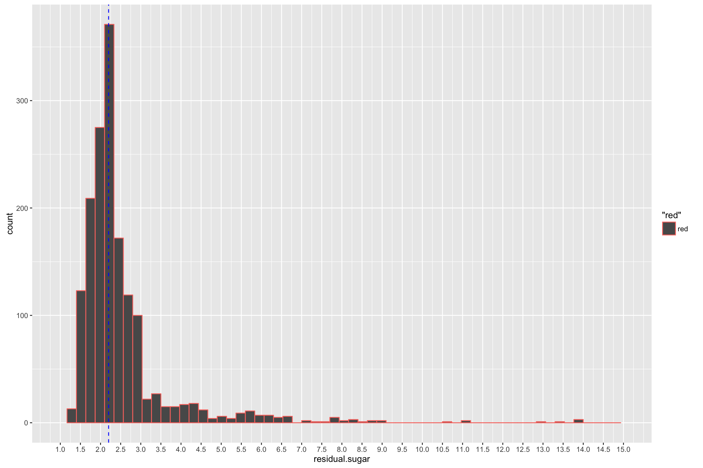

We see that half of wine have a residual sugar more than 2.2 with a distribution more skewed to the right.

Summary statistics for residual sugar below:

    ##    Min. 1st Qu.  Median    Mean 3rd Qu.    Max. 
    ##   0.900   1.900   2.200   2.539   2.600  15.500

Logarithmic transformation of residual.sugar in the figure below

We see from the figure above that the residual sugar's distribution tends be more nomral when a logarithmic scale is applied and the the top 5% of the values are removed.

From the plot above we can see that the median values of residual sugar don't significantly change accross the different quality categories as seen with the other variables above. We can verify that with the following summary:

    ## Source: local data frame [6 x 2]
    ## 
    ##   quality median(residual.sugar)
    ##     (int)                  (dbl)
    ## 1       3                    2.1
    ## 2       4                    2.1
    ## 3       5                    2.2
    ## 4       6                    2.2
    ## 5       7                    2.3
    ## 6       8                    2.1

1.  'Sulphates' distribution

From the plot above, we see that half of the wine have a sulphate level more than 0.625.

The plot above shows a sulphate distribution closer to normal when logarithmic transformation is applied.

Summary statistics for sulphates:

    ##    Min. 1st Qu.  Median    Mean 3rd Qu.    Max. 
    ##  0.3300  0.5500  0.6200  0.6581  0.7300  2.0000

From the plot above, we see that the count of wine with a sulphate level greater than 0.625 becomes significantly more than 50% as the wine quality improves.

1.  pH distribution

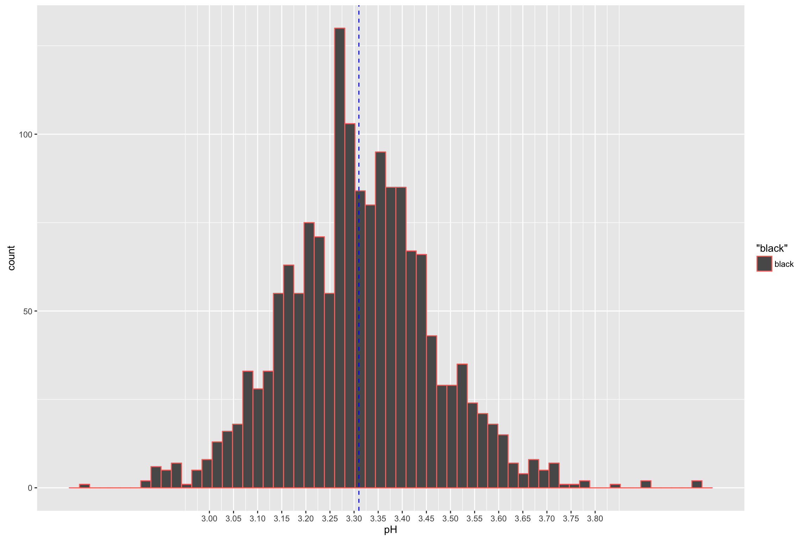

The plot above shows that pH has a distribution close to a 'normal' one.

It's difficult to tell from the plots above whether the median pH significantly changes accross the different categories.

Summary statistics for pH below:

    ##    Min. 1st Qu.  Median    Mean 3rd Qu.    Max. 
    ##   2.740   3.210   3.310   3.311   3.400   4.010

    ## Source: local data frame [6 x 2]
    ## 
    ##   quality median(pH)
    ##     (int)      (dbl)
    ## 1       3       3.39
    ## 2       4       3.37
    ## 3       5       3.30
    ## 4       6       3.32
    ## 5       7       3.28
    ## 6       8       3.23

The above summary shows that pH does decrease as the quality improves, the scale of the drop in pH is not large enough to be visualized on the facet plots seen above.

1.  'Fixed acidity' distribution

The plot above shows that fixed acidity seems to follows a distribution close to a 'normal' one.

Summary statistics for fixed acidity below:

    ##    Min. 1st Qu.  Median    Mean 3rd Qu.    Max. 
    ##    4.60    7.10    7.90    8.32    9.20   15.90

    ## Source: local data frame [6 x 3]
    ## 
    ##   quality median(fixed.acidity) mean(fixed.acidity)
    ##     (int)                 (dbl)               (dbl)
    ## 1       3                  7.50            8.360000
    ## 2       4                  7.50            7.779245
    ## 3       5                  7.80            8.167254
    ## 4       6                  7.90            8.347179
    ## 5       7                  8.80            8.872362
    ## 6       8                  8.25            8.566667

The summary above shows that fixed.acidity tends to increase as wine quality improves. The change in fixed.acidity is in concert with the change in pH (since more acidity lowers the pH) as seen above.

1.  'Density' distribution

Density seems to follow a distribution close to a 'normal' one.

Summary statistics for density below:

    ##    Min. 1st Qu.  Median    Mean 3rd Qu.    Max. 
    ##  0.9901  0.9956  0.9968  0.9967  0.9978  1.0040

    ## Source: local data frame [6 x 3]
    ## 
    ##   quality median(density) mean(density)
    ##     (int)           (dbl)         (dbl)
    ## 1       3        0.997565     0.9974640
    ## 2       4        0.996500     0.9965425
    ## 3       5        0.997000     0.9971036
    ## 4       6        0.996560     0.9966151
    ## 5       7        0.995770     0.9961043
    ## 6       8        0.994940     0.9952122

Based on the summary above, 'density' seems not to significantly change with quality.

1.  Citric acid distribution

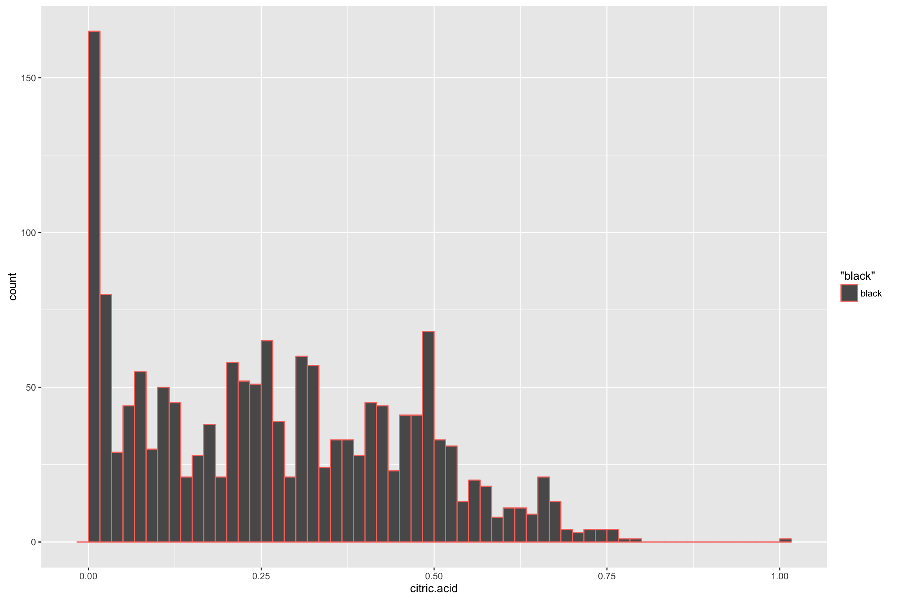

'Citric acid' seems not to have a particular distribution.

Summary statistics for citric acid below:

    ##    Min. 1st Qu.  Median    Mean 3rd Qu.    Max. 
    ##   0.000   0.090   0.260   0.271   0.420   1.000

1.  Chlorides distribution

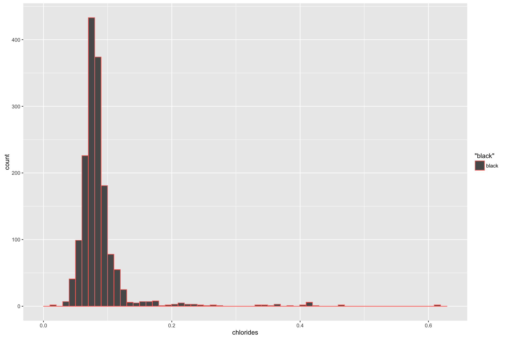

'Chlorides' seems to follow a 'normal' distribution.

Summary statistics for Chlorides below:

    ##    Min. 1st Qu.  Median    Mean 3rd Qu.    Max. 
    ## 0.01200 0.07000 0.07900 0.08747 0.09000 0.61100

    ## Source: local data frame [6 x 3]
    ## 
    ##   quality median(chlorides) mean(chlorides)
    ##     (int)             (dbl)           (dbl)
    ## 1       3            0.0905      0.12250000
    ## 2       4            0.0800      0.09067925
    ## 3       5            0.0810      0.09273568
    ## 4       6            0.0780      0.08495611
    ## 5       7            0.0730      0.07658794
    ## 6       8            0.0705      0.06844444

'Chlorides' levels especially the mean value tend to decrease as the quality increases. Increased Chloride level would be associated with a salty taste of the wine, it's expected that wine with good quality shouldn't taste salty.

1.  'Free sulfur dioxide' distribution

The plot above shows that 'free sulfur dioxide' seems to follow a right skewed distribution that becomes more overt with the 'sqrt' transfomation.

Summary statistics for free sulfur dioxide below:

    ##    Min. 1st Qu.  Median    Mean 3rd Qu.    Max. 
    ##    1.00    7.00   14.00   15.87   21.00   72.00

1.  'Total sulfur dioxide' distribution

The plot above shows that 'total sulfur dioxide' seems also to follow a right skewed distribution.

Summary statistics for 'total sulfur dioxide' below:

    ##    Min. 1st Qu.  Median    Mean 3rd Qu.    Max. 
    ##    6.00   22.00   38.00   46.47   62.00  289.00

    ## Source: local data frame [6 x 3]
    ## 
    ##   quality mean(total.sulfur.dioxide) median(total.sulfur.dioxide)
    ##     (int)                      (dbl)                        (dbl)
    ## 1       3                   24.90000                         15.0
    ## 2       4                   36.24528                         26.0
    ## 3       5                   56.51395                         47.0
    ## 4       6                   40.86991                         35.0
    ## 5       7                   35.02010                         27.0
    ## 6       8                   33.44444                         21.5

The summary above shows that 'total sulfur dioxide' levels increase as the quality improves. This finding is expected since sulfur dioxide is an antioxidant that helps protect the wine from spoiling.

B. Let's explore some plots and relations between the different variables excluding quality.
--------------------------------------------------------------------------------------------

1.Relation between alcohol and sugar. Since the transformation from sugar to alcohol (fermentation) is the basis for alcohol production, it would be assumed that as alcohol level increases, sugar level should decrease.

The previous plot shows that what we expected is not true, as the geom\_smooth line seems to be flat with a slop close to 0.

Correlation between alochol and residual sugar below:

    ## 
    ##  Pearson's product-moment correlation
    ## 
    ## data:  wine$alcohol and wine$residual.sugar
    ## t = 1.6829, df = 1597, p-value = 0.09258
    ## alternative hypothesis: true correlation is not equal to 0
    ## 95 percent confidence interval:
    ##  -0.006960058  0.090909069
    ## sample estimates:
    ##        cor 
    ## 0.04207544

Weak correlation coefficient of 0.04 consistent with the plot above.

2.Relation between volatile.acidity and pH

The previous plot shows that 'pH' seems not to change much with volatile.acidity. It might be something good since increased volatile.acidity negatively affects quality and good wine has a lower pH.

    ## 
    ##  Pearson's product-moment correlation
    ## 
    ## data:  wine$volatile.acidity and wine$pH
    ## t = 9.659, df = 1597, p-value < 2.2e-16
    ## alternative hypothesis: true correlation is not equal to 0
    ## 95 percent confidence interval:
    ##  0.1880823 0.2807254
    ## sample estimates:
    ##       cor 
    ## 0.2349373

Coefficient of 0.234 demonstrating weak correlation between volatile acidy and pH.

3.Relation between fixed.acidity and pH

The previous plot shows that, as fixed.acidity increases pH decreases.

    ## 
    ##  Pearson's product-moment correlation
    ## 
    ## data:  wine$fixed.acidity and wine$pH
    ## t = -37.366, df = 1597, p-value < 2.2e-16
    ## alternative hypothesis: true correlation is not equal to 0
    ## 95 percent confidence interval:
    ##  -0.7082857 -0.6559174
    ## sample estimates:
    ##        cor 
    ## -0.6829782

The strong negative correlation above confirms the inverse relationship between pH and fixed acidity as seen on the plot.

4.Relation between citric.acid and pH, since some wine manufacturers add citric acid to lower their wine's pH.

The previous plot shows that pH decreases especially with higher concentrations of citric acid

    ## 
    ##  Pearson's product-moment correlation
    ## 
    ## data:  wine$citric.acid and wine$pH
    ## t = -25.767, df = 1597, p-value < 2.2e-16
    ## alternative hypothesis: true correlation is not equal to 0
    ## 95 percent confidence interval:
    ##  -0.5756337 -0.5063336
    ## sample estimates:
    ##        cor 
    ## -0.5419041

The negative correlation coefficient above demonstrates the inverse relationship between citric acid and pH, albeit, it's a weaker correlation that the one between pH and fixed acidity.

5.Relation between chlorides and pH

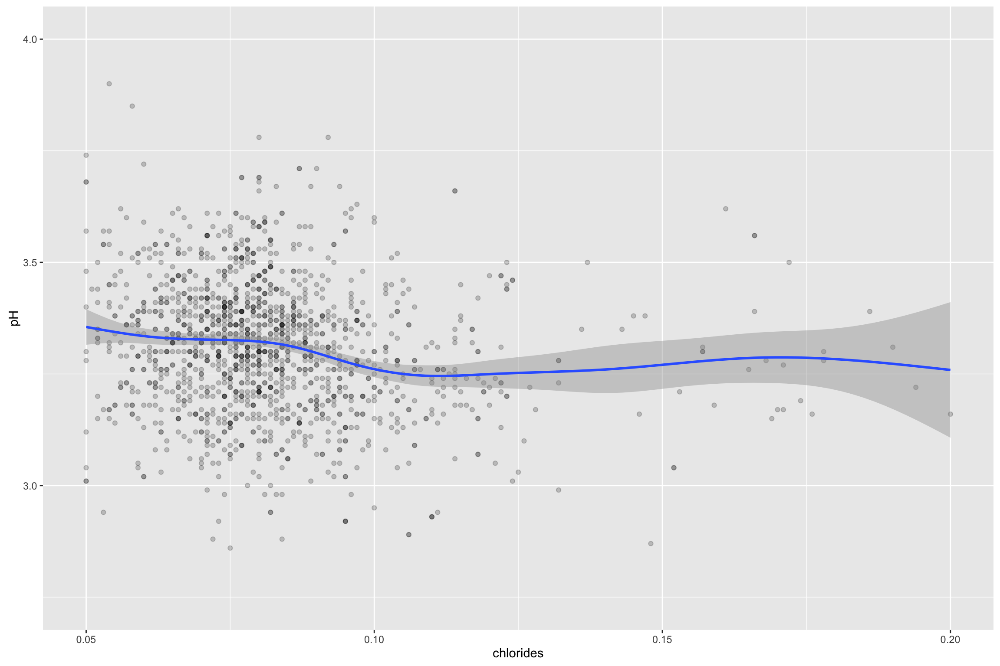

This previous plot shows that increased chlorides level seem not to lower the pH (since Chloride is usually bound the proton H+ which could lower acidity and thus pH)

    ## 
    ##  Pearson's product-moment correlation
    ## 
    ## data:  wine$pH and wine$chlorides
    ## t = -10.984, df = 1597, p-value < 2.2e-16
    ## alternative hypothesis: true correlation is not equal to 0
    ## 95 percent confidence interval:
    ##  -0.3100195 -0.2188482
    ## sample estimates:
    ##        cor 
    ## -0.2650261

The correlation coefficient of -0.26 between pH and chlorides is weak.

6.Relation between volatile.acidity and sulfur.dioxide, since sulfur.dioxide is an anti-oxidant that helps prevent the wine from spoiling, and more volatile.acidity is associated with wine fault.

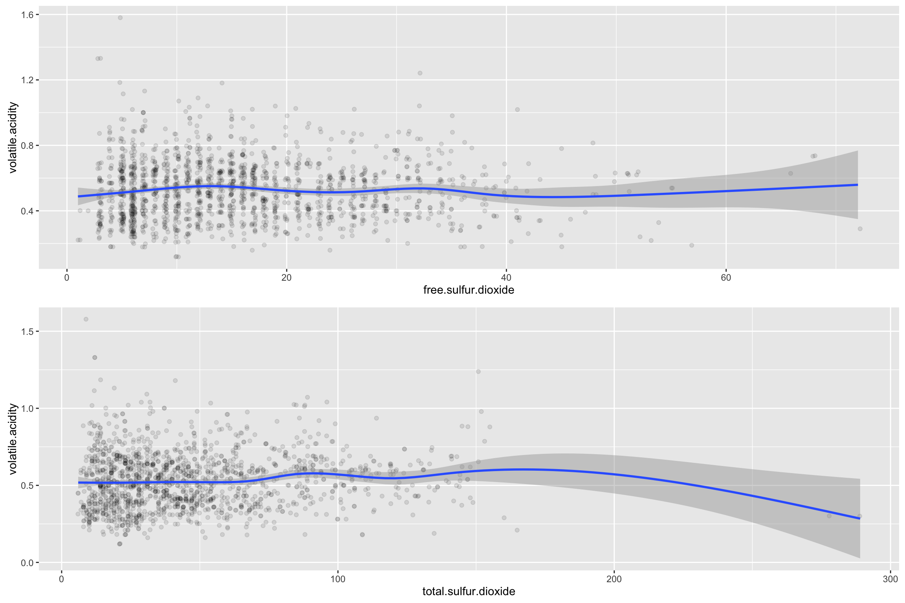

The previous graph shows no significant effect of sulfur.dioxide on volatile.acidity.

cor.test(wine$volatile.acidity,wine)

C. Relationships between quality and the other different factors
----------------------------------------------------------------

1.How the mean of volatile.acidity changes with quality

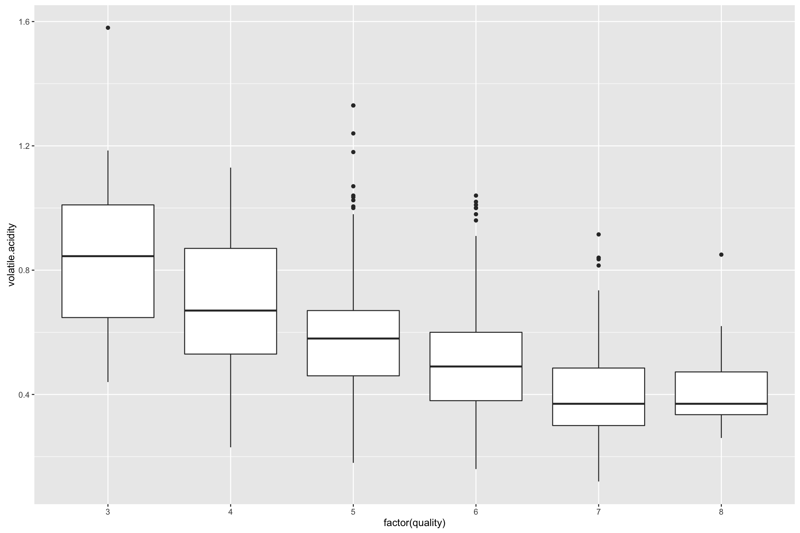

    ## Source: local data frame [6 x 4]
    ## 
    ##   quality median.volatile.acidity mean.volatile.acidity     n
    ##     (int)                   (dbl)                 (dbl) (int)
    ## 1       3                   0.845             0.8845000    10
    ## 2       4                   0.670             0.6939623    53
    ## 3       5                   0.580             0.5770411   681
    ## 4       6                   0.490             0.4974843   638
    ## 5       7                   0.370             0.4039196   199
    ## 6       8                   0.370             0.4233333    18

The previous plot and stats show that as median and mean 'volatile.acidity' increase, quality decreases.

2.How alcohol level changes with quality

The previous plot shows that alcohol level tends to increase as quality increases

    ## Source: local data frame [6 x 3]
    ## 
    ##   quality median_alcohol mean_alcohol
    ##     (int)          (dbl)        (dbl)
    ## 1       3          9.925     9.955000
    ## 2       4         10.000    10.265094
    ## 3       5          9.700     9.899706
    ## 4       6         10.500    10.629519
    ## 5       7         11.500    11.465913
    ## 6       8         12.150    12.094444

The previous plot shows that overall quality increases as alcohol level increases.

3.How density changes with quality

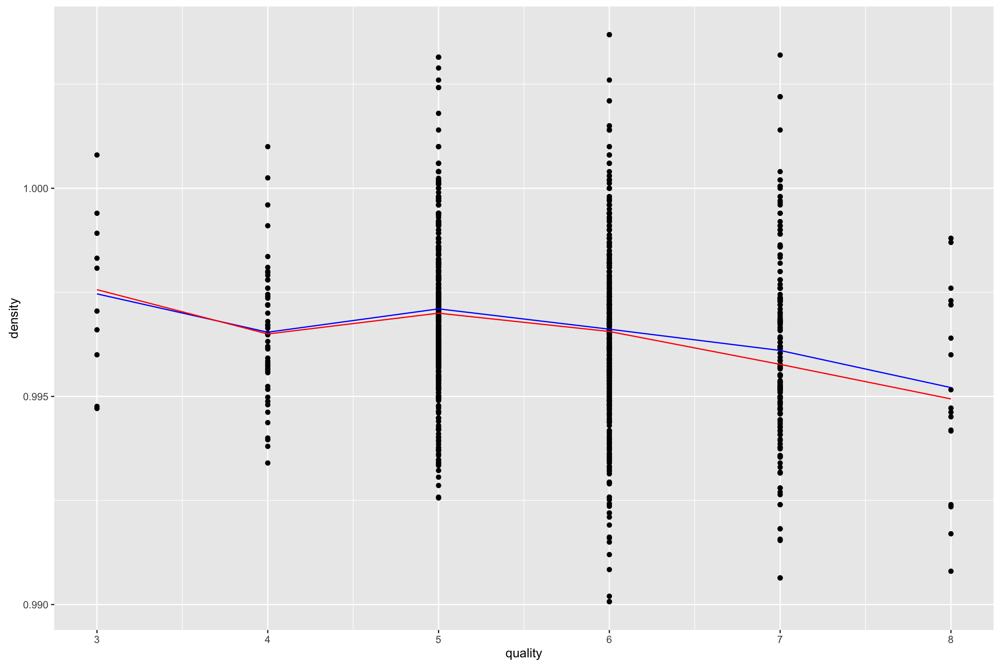

The previous plot shows that density tends to slightly decrease as quality increases

The previous plot shows that as density increases quality decreases.

4.How pH changes with quality

The previous plot shows that pH seems to slightly decrease as quality increases

The previous plot sows that as pH increases quality decreases

5.How sulphates change with quality

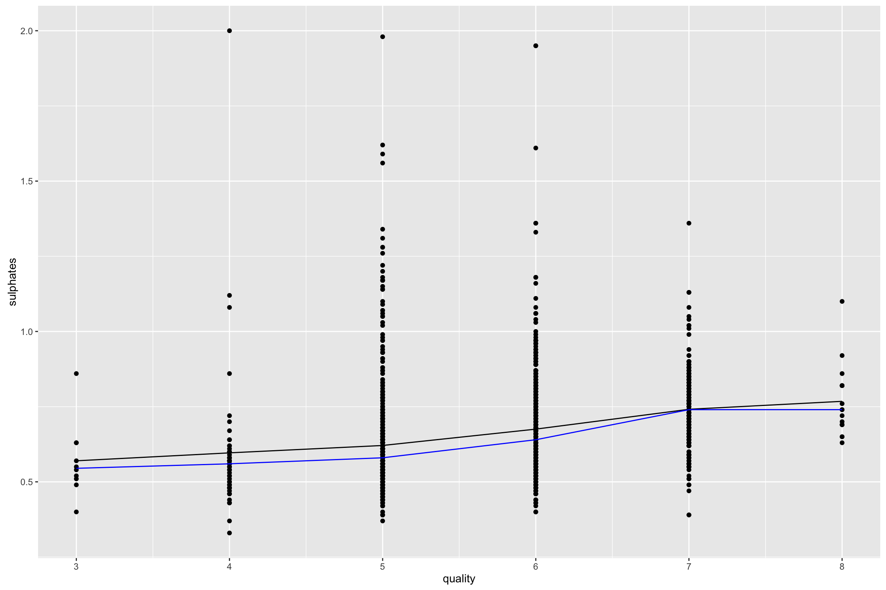

The previous plot shows that sulphates level tends to increase as quality increases

    ## Source: local data frame [6 x 3]
    ## 
    ##   quality median_sulphates mean_sulphates
    ##     (int)            (dbl)          (dbl)
    ## 1       3            0.545      0.5700000
    ## 2       4            0.560      0.5964151
    ## 3       5            0.580      0.6209692
    ## 4       6            0.640      0.6753292
    ## 5       7            0.740      0.7412563
    ## 6       8            0.740      0.7677778

The previous plot shows that as sulphates increase quality increases.

D. Multivariate charts
----------------------

1.Plot depicting the relationship between alcohol,residual sugar and quality.

The plot above shows that residual sugar doesn't depend on quality whereas alcohol level goes up as quality goes up.

2.Since six colors for the variable factor(quality) may be cumbersome to the naked eye, I removed the observations with quality=3 and quality=8 (they are both small samples as well). The new dataset will be 'wine1'

3.The following plot depicts the relationship between alcohol,sulphates and quality using the 'wine1' dataset.

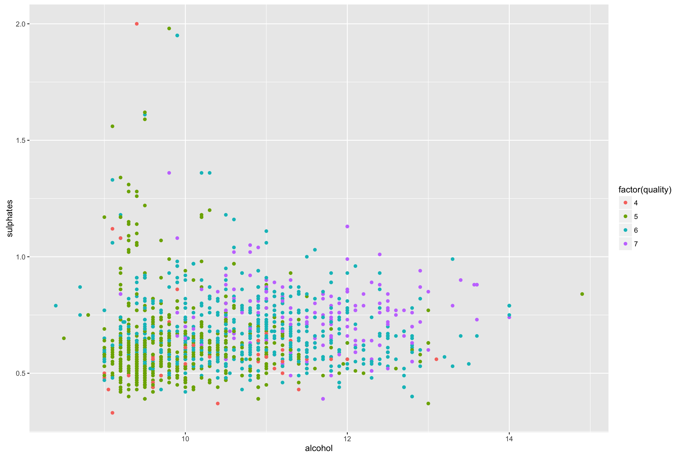

The previous plot shows that alcohol with good quality (points in purple) tend to be clustered in the area with higher sulphates and alcohol level when compared for instance to the clustering of the points in green (poorer quality).

1.  The following plot depicts the relationship between volatile acidity, alcohol level and quality in the 'wine1' dataset

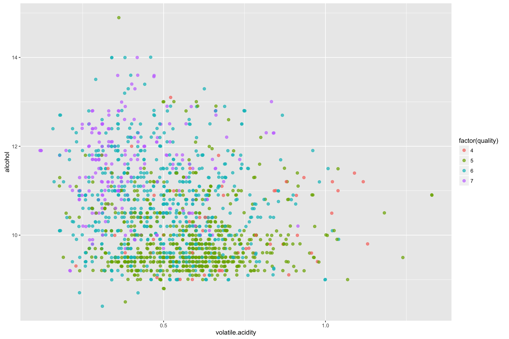

The above plot shows that the purple dots (wine with good quality) tend to be clustered in the area corresponding to higher alcohol level and lower volatile acidity when compared with the green and burgundy dots (wine with poorer quality)

### Final Plots and Summary

.Since volatile acidity, alcohol, and sulphates level change with quality, will categorize quality and will create some plots to see different patterns depicting the relation of these variables to quality.

Creating the six quality categories from A (the best wine) to F (the worst wine)

This boxplot shows how volatile.acidity range changes across quality categories
-------------------------------------------------------------------------------

It seems obvious from the plot above (polished plot of C.1), that 'volatile acidity' decreases as quality increases. Since volatile acidity is a continuous variable and Quality is a categorical variable, a boxplot is one of the options to plot these 2 variables. Also the stats of C.1 as demonstrated in this plot show that median 'volatile acidity' decreases from 0.845 for quality F (worst quality) to 0.370 for quality A (best quality). Likewise for the mean which decreases from 0.884 for quality F to 0.42 for quality A.

This following plot shows how alcohol level and sulphates change across quality categories
------------------------------------------------------------------------------------------

The plot above (polished plot of A.1) shows that alcohol level tends to be in the higher range as quality improves from F (the lowest quality) to A (the best quality). The dashed line in red corresponds to the median alcohol level of all the observations with a value of 10.20. Based on the stats of C.2 and as demonstrated in this plot, it's clear that the median values of alcohol A and alcohol B (12.15 and 11.5,respectively) are higher than the median alcohol level of all the observations.

This following histogram shows how sulphates and alcohol change across quality categories
-----------------------------------------------------------------------------------------

From the plot above (polished plot of D.3), sulphates levels of the good quality wine (in purple and blue) have a distribution in the higher range when compared to wine of poorer quality (in green). The stats of C.5 show that the median 'sulphate' level of the 'purple' wine is 0.74 compared to the median sulphate level of 0.58 belonging to the 'green' wine. The stats of C.2 show that the the 'purple' alcohol median is 11.2 compared to the 'green' alcohol median of 9.7.

Reflection
----------

We see a clear relation between 'wine quality' on one hand and 'alcohol level', 'volatile acidity', 'sulphates' and 'density'. Alcohol level positively affects wine quality, one would assume that if alcohol level is low, the residual sugar is high; but interestingly the plot between the two variables shows a slope close to 0. Another contradictory point in the plot is that alcohol level in quality 3 is higher than alochol level in quality 4.

Volatile acidity negatively affects quality, this relationship is expected; since volatile acidity is product of wine oxidation leading to the production and release of volatile acid (chemical oxidation reduces wine quality).

'Sulphates' and its different derivatives like 'sulfur dioxide' are added sometimes by wine makers to slow down the oxidation and spoilage of wine. The plot shows a clear postive impact of 'Sulphates' on wine quality. Interestingly, another plot shows no clear relation between 'sulfur dioxide' and 'volatile acidity' (volatile acidity negatively impacts wine quality).

Plotting against quality was a little chanllenging since 'quality' was a discrete variable with only 6 values. I had to convert it to a categorical variable in order to create some plots like the final three ones.

The analysis of the 'red wine' dataset was interesting and I would like sometime to do an analysis on a 'white wine' dataset and see if the variables impacting the red wine quality will still be relevant when it comes to white wine.
